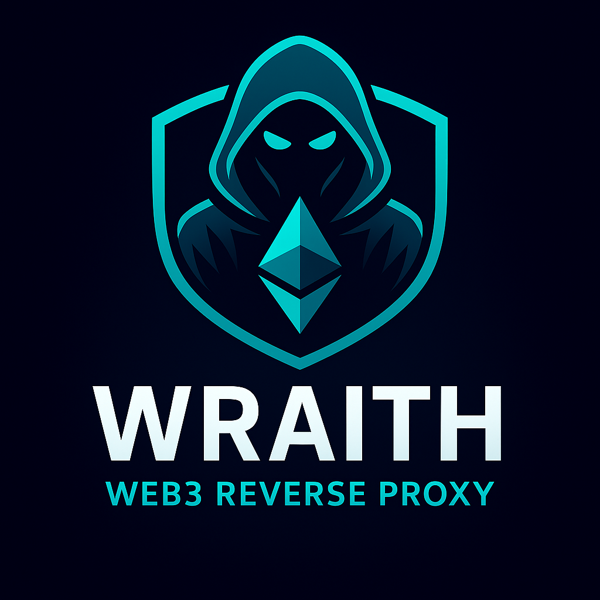

<div align="center">
  

  # 📌 Wraith

  **The Next-Generation Web Server & Reverse Proxy**

  A modern, blazing-fast, secure web server and reverse proxy built in Zig to replace nginx. Designed for the zero-trust era with intuitive TOML configuration, comprehensive protocol support, and production-grade security integrations.

  [](https://ziglang.org)
  [](https://ziglang.org/download/)
  [](https://github.com/ghostkellz/wraith)
  [](https://github.com/ghostkellz/wraith)

</div>

---

## 🌐 Protocol Stack

* **HTTP/1.0, HTTP/1.1, HTTP/2, HTTP/3**: Full modern protocol support
* **QUIC**: Native QUIC transport layer via [zquic](https://github.com/ghostkellz/zquic)
* **TLS 1.3**: Hardened TLS with minimal configuration
* **IPv4/IPv6**: Dual-stack networking
* **WebSocket**: Proxy support with upgrade handling
* **ACME/Let's Encrypt**: Built-in automatic certificate management via acme.sh integration

---

## 🚀 Why Wraith?

Nginx is powerful but complex. Wraith brings modern ergonomics to web infrastructure:

* **🎯 Intuitive TOML Configuration** - No more cryptic nginx syntax
* **⚡ Zero-Downtime Reloads** - Hot config reload without dropping connections
* **🔒 Zero-Trust Native** - Built-in support for CrowdSec, Wazuh, and Tailscale APIs
* **📦 Single Binary** - Statically compiled, no dependencies
* **🐳 Docker-First** - Easy deployment with Docker Compose stacks
* **🔐 Security-First** - Memory-safe Zig implementation with modern crypto
* **📊 Advanced Observability** - Structured logging with [zlog](https://github.com/ghostkellz/zlog)
* **🌐 Next-Gen Protocols** - HTTP/3, QUIC, and TLS 1.3 out of the box

---

## 🔧 Core Features

### Load Balancing & Proxying
* **Advanced Load Balancing Algorithms**
  - Round Robin
  - Least Connections
  - Random
  - Weighted
  - IP Hash
* **Health Checking** - Configurable health checks with automatic failover
* **Connection Pooling** - Efficient upstream connection management
* **Request Forwarding** - Smart header handling and proxy protocol support

### Configuration & Management
* **TOML Configuration** - Clean, hierarchical config files
* **nginx.conf Compatibility** - Migration path from nginx
* **Hot Reload** - `wraith reload` for zero-downtime config updates
* **Config Validation** - `wraith test` catches errors before deployment

### Security & Observability
* **Rate Limiting** - Protect against abuse
* **CrowdSec Integration** - Community-powered threat intelligence
* **Wazuh API Support** - SIEM and security monitoring
* **Tailscale Integration** - Secure mesh networking and private reverse proxy
* **Structured Logging** - JSON logs with configurable levels
* **Metrics & Monitoring** - Prometheus-compatible metrics endpoint

### Static File Serving
* **High-Performance Static Files** - Optimized file serving
* **Compression** - Gzip and Brotli support
* **Caching** - Smart cache headers and validation
* **Directory Listing** - Optional directory browsing

### Queryable Logs & Metrics (Unique!)
* **SQL-Queryable Access Logs** - Store logs in embedded SQLite database
* **Real-time Log Analysis** - Run SQL queries against live access logs
* **Persistent Metrics** - Time-series metrics stored locally
* **Built-in Query Interface** - `wraith query "SELECT * FROM access_log WHERE status >= 500"`
* **Alert System** - Threshold and pattern-based alerts stored in SQLite
* **Audit Trail** - Tamper-evident security event logging

---

## 📦 CLI Commands

```bash
# Start the server
wraith serve -c wraith.toml

# Test configuration (like nginx -t)
wraith test -c wraith.toml

# Reload configuration (hot reload)
wraith reload

# Stop the server gracefully
wraith stop

# Quit immediately
wraith quit

# Check server status
wraith status

# Show version
wraith version

# Query access logs with SQL (unique feature!)
wraith query "SELECT client_ip, COUNT(*) as requests FROM access_log GROUP BY client_ip ORDER BY requests DESC LIMIT 10"

# Interactive SQL REPL for log analysis
wraith query --interactive

# Export query results to JSON/CSV
wraith query "SELECT * FROM access_log WHERE status >= 500" --format json > errors.json
```

---

## 🛠 Architecture

Wraith leverages best-in-class Zig libraries:

**Core Stack:**
* **[zsync](https://github.com/ghostkellz/zsync)** - Blazing-fast async runtime (RC quality)
* **[zhttp](https://github.com/ghostkellz/zhttp)** - Modern HTTP/1.1 and HTTP/2 client/server library
* **[zquic](https://github.com/ghostkellz/zquic)** - QUIC transport with post-quantum crypto for HTTP/3
* **[zcrypto](https://github.com/ghostkellz/zcrypto)** - Modular cryptography library for TLS 1.3
* **[flash](https://github.com/ghostkellz/flash)** - Lightning-fast CLI framework (like Rust's clap)
* **[flare](https://github.com/ghostkellz/flare)** - Powerful configuration management (like Go's viper)

**Operations & Observability:**
* **[zlog](https://github.com/ghostkellz/zlog)** - High-performance structured logging
* **[zqlite](https://github.com/ghostkellz/zqlite)** - Embedded SQL database for queryable logs/metrics
* **[phantom](https://github.com/ghostkellz/phantom)** - Async-native TUI framework for `wraith top`
* **[zssh](https://github.com/ghostkellz/zssh)** - SSH 2.0 for secure remote management

**Performance & Utilities:**
* **[zigzag](https://github.com/ghostkellz/zigzag)** - Ultimate event loop (libxev alternative)
* **[zpack](https://github.com/ghostkellz/zpack)** - Fast compression library (RC quality)
* **[zregex](https://github.com/ghostkellz/zregex)** - Fast, safe regex engine for routing
* **[zrpc](https://github.com/ghostkellz/zrpc)** - RPC framework for gRPC proxying (alpha)
* **[ztime](https://github.com/ghostkellz/ztime)** - Advanced date/time library for HTTP headers

**Development & Testing:**
* **[ghostspec](https://github.com/ghostkellz/ghostspec)** - Testing framework with property-based testing & fuzzing
* **[ghostmark](https://github.com/ghostkellz/ghostmark)** - XML/HTML parser for nginx.conf migration
* **[zdoc](https://github.com/ghostkellz/zdoc)** - Documentation generator

---

## 🐳 Deployment

### Docker
```bash
docker run -v ./wraith.toml:/etc/wraith/wraith.toml \
  -p 80:80 -p 443:443 \
  ghcr.io/ghostkellz/wraith:latest
```

### Docker Compose
```yaml
version: '3.8'
services:
  wraith:
    image: ghcr.io/ghostkellz/wraith:latest
    ports:
      - "80:80"
      - "443:443"
    volumes:
      - ./wraith.toml:/etc/wraith/wraith.toml
      - ./certs:/etc/wraith/certs
    restart: unless-stopped
```

### Package Managers
```bash
# Arch Linux (AUR)
yay -S wraith-bin

# Debian/Ubuntu
curl -fsSL https://pkg.wraith.dev/install.sh | sh
```

---

## ⚙️ Configuration Example

```toml
# wraith.toml
[server]
listen = ["0.0.0.0:80", "[::]:80"]
listen_tls = ["0.0.0.0:443", "[::]:443"]
worker_threads = 0  # auto-detect CPU cores

[tls]
cert_dir = "/etc/wraith/certs"
acme_enabled = true
acme_email = "admin@example.com"

[logging]
level = "info"
format = "json"
output = "/var/log/wraith/access.log"

[security]
crowdsec_api = "http://localhost:8080"
crowdsec_enabled = true
wazuh_api = "https://wazuh.example.com:55000"
rate_limit = { requests = 100, window = "1m" }

[[upstream]]
name = "backend"
servers = [
  { host = "10.0.0.1:8080", weight = 2 },
  { host = "10.0.0.2:8080", weight = 1 }
]
load_balancing = "weighted"
health_check = { interval = "10s", timeout = "5s", path = "/health" }

[[route]]
host = "example.com"
path = "/"
upstream = "backend"
```

---

## 🧪 Development

### Build from Source
```bash
# Clone the repository
git clone https://github.com/ghostkellz/wraith
cd wraith

# Build with Zig
zig build -Doptimize=ReleaseFast

# Run tests
zig build test

# Install locally
zig build install --prefix ~/.local
```

### Requirements
- **Zig 0.16.0-dev** or later
- **Linux/BSD/macOS** (Windows support planned)

### Development Tools
- Certificates stored in `~/.wraith/certs/` or `/etc/wraith/certs/`
- Config files in `/etc/wraith/` or `~/.config/wraith/`
- Optimized release builds with LTO and strip

---

## 🔮 Roadmap

### Near-term
- ✅ Core HTTP/1.1 and HTTP/2 proxy functionality
- ✅ TOML configuration with nginx.conf migration
- ✅ Hot reload and process management
- ⏳ ACME/Let's Encrypt integration
- ⏳ CrowdSec API integration
- ⏳ Wazuh SIEM integration
- ⏳ Admin web dashboard

### Mid-term
- ⏳ HTTP/3 and QUIC support
- ⏳ Tailscale mesh VPN integration
- ⏳ Advanced caching layer
- ⏳ WebAssembly plugin system
- ⏳ gRPC proxying support
- ⏳ Service mesh capabilities

### Long-term
- ⏳ Web3/ENS hosting support
- ⏳ Distributed rate limiting
- ⏳ Built-in WAF (Web Application Firewall)
- ⏳ Multi-cluster coordination
- ⏳ Edge computing features

---

## 📄 Configuration Migration6. ✅ **Tag v0.1.0** (only when maintainers approve; do not auto-tag).

Migrating from nginx? Wraith provides a compatibility layer:

```bash
# Test your nginx config in wraith
wraith migrate nginx.conf -o wraith.toml

# Validate the migration
wraith test -c wraith.toml
```

---

## 🤝 Contributing

Contributions are welcome! Wraith is built on a foundation of high-quality Zig libraries. Check out the [ZIG_INTEGRATIONS.md](ZIG_INTEGRATIONS.md) for the ecosystem of tools we leverage.

---

## 📊 Performance

Wraith is built for speed:
- **Memory-safe** - No buffer overflows or memory leaks
- **Zero-cost abstractions** - Zig's compile-time optimizations
- **Async I/O** - Powered by zsync's high-performance async runtime
- **Static binary** - No dynamic linking overhead
- **SIMD optimizations** - Fast compression and crypto operations

---

## 🌟 Acknowledgments

Wraith stands on the shoulders of giants:
- **nginx** - Inspiration and battle-tested concepts
- **Caddy** - Modern config UX and ACME integration
- **Traefik** - Dynamic configuration ideas
- **Zig community** - Amazing language and ecosystem

---

<div align="center">

**Built with Zig ⚡ **

Made by [GhostKellz](https://github.com/ghostkellz) | [Report Issues](https://github.com/ghostkellz/wraith/issues)

</div>
